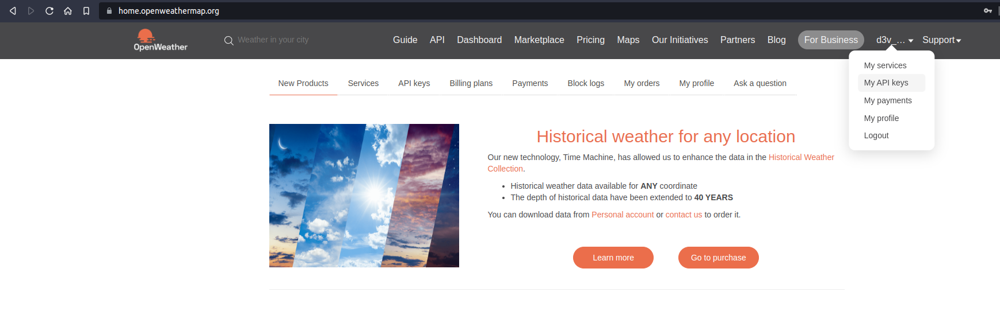
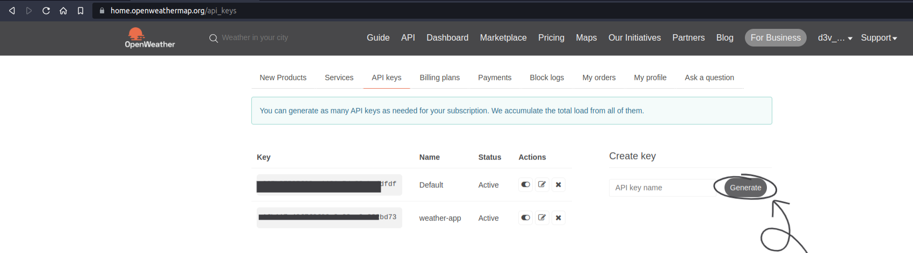

## NodeJS-Weather-Fetcher
---
### Prerequisites
    
These packages are needed beforehand :
- [nodejs (v16.16.1)](https://github.com/nodejs/node/tree/v16.x) 
- [npm@8.15.1](https://github.com/npm/cli/tree/latest)
- Create an account in [openweathermap.org/](https://openweathermap.org/)

### Getting Started 

Clone the repo into your local machine
```sh
git clone https://github.com/d3v-anaxa/NodeJS-Weather-Fetcher.git
```
 Move to the cloned directory

```sh
cd ./NodeJS-Weather-Fetcher
```
Login to [openweathermap.org/](https://openweathermap.org/) and go to 'My API Keys'



Generate a new API key and copy that



Then run the following command in the terminal

```sh
echo "<APIKEY>" >> .env
```

### Running Through the program

Run this command for furthur results[^note] 

```sh
node main.js <location-name>
```

[^note]: ***< location-name > can be a valid name of any Continent | Country | City***

**Example Commands :**
```sh
node main.js Asia
```

```sh
node main.js India
```

### Contribution

Please give feedback about the project 💟